# ZML V2 and Zig 0.16: A High-Level Flyover

There is considerable excitement around **[Zig](https://ziglang.org/)** [0.16(master)](https://ziglang.org/documentation/master/)  and **[ZML (Zig Machine Learning)](https://zml.ai/)**, but getting started can feel overwhelming. Integrating these tools with a mature build system like **[Bazel](https://bazel.build/)** adds an additional layer of complexity.

This guide walks through a real project—a benchmarking suite—where five classical algorithms are implemented **three ways**: a naive reference, a CPU-optimized version, and a ZML V2 tensor version. The goal is not just to measure speed, but to understand *how* each layer works, *why* the code looks the way it does, and *what happens under the hood* when ZML compiles to MLIR, StableHLO, and runs via PJRT on different hardware backends.

The five benchmarks are:
1. **SAXPY** — scalar multiplication and vector addition
2. **MatMul** — dense matrix multiplication
3. **ModMatMul** — matrix multiplication with modulo (lattice-crypto style)
4. **Heat Transfer** — 2D stencil simulation
5. **Black-Scholes** — option pricing model

---

## Project Architecture

```text
zml-tuto/
├── MODULE.bazel         # Bzlmod: declares Zig 0.16, ZML, LLVM toolchain deps
├── BUILD.bazel          # Top-level: exposes ZLS completion target
└── simple/
    ├── BUILD.bazel      # Bazel targets: zig_library, zig_binary, zig_test
    ├── main.zig         # Entry point: creates Context, runs all 5 benchmarks
    ├── context.zig      # Shared state: allocator, IO handle, ZML Platform, RNG
    ├── benchmarks.zig   # Orchestrator: times all 3 strategies, verifies outputs
    ├── reference.zig    # Baseline: plain single-threaded scalar Zig loops
    ├── optimized.zig    # CPU-opt: multi-thread (std.Thread) + SIMD (@Vector)
    ├── model.zig        # ZML V2: tensor model definitions (SimpleModel struct)
    ├── tests.zig        # Unit tests: reference vs optimized
    └── tests_zml_main.zig # Unit tests: ZML model correctness
```

* **`BUILD.bazel`**: Contains the Bazel build targets (`simple_lib`, `simple`, `simple_test`, and `simple_test_zml`).
* **`main.zig`**: The entry point that initializes the context and triggers the benchmarks.
* **`benchmarks.zig`**: The core runner that allocates buffers, measures execution time (`std.Io.Clock`), and verifies that the Optimized and ZML outputs match the Reference outputs using a defined epsilon.
* **`context.zig`**: Manages memory allocators, standard random number generation, and the `zml.Platform` state.
* **`model.zig`**: Defines the `SimpleModel` struct containing all ZML tensor logic.
* **`optimized.zig`**: Contains the parallelized and vectorized algorithm implementations.
* **`reference.zig`**: Contains the baseline scalar implementations.
* **`tests.zig` & `tests_zml_main.zig`**: Unit tests verifying the mathematical correctness of both the optimized code and the ZML models against expected values.

The separation into `reference.zig`, `optimized.zig`, and `model.zig` is the core pedagogical decision. Each file represents a distinct mental model of computation: imperative loops, data-parallel CPU, and traced tensor graphs. `benchmarks.zig` acts as a neutral runner that calls all three, verifies correctness against `reference.zig`, and reports timing.

---

## Deep Dive: Bazel as the Build Foundation

### Why Bazel?

ZML V2 relies on LLVM, MLIR, and OpenXLA—a large, multi-language native dependency graph. Zig 0.16 is a pre-release toolchain. Managing this with a Makefile would be unworkable.

Bazel was chosen for three reasons:
1. **Hermetic builds:** Every input is declared. No implicit system dependencies.
2. **Multi-language dependency graph:** Zig, C++, LLVM, and MLIR are all managed in one dependency graph.
3. **Incremental caching:** Only changed targets are rebuilt. Modifying `model.zig` does not recompile the LLVM toolchain.

### The Dependency Graph


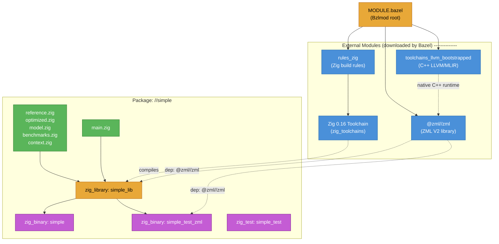

### MODULE.bazel — Pinning Dependencies

```starlark
module(name = "simple", version = "0.1.0")

bazel_dep(name = "rules_zig", version = "0.12.3")
bazel_dep(name = "zml", version = "0.0.0")
bazel_dep(name = "rules_cc", version = "0.2.16")
bazel_dep(name = "toolchains_llvm_bootstrapped", version = "0.5.5")

# Pin to a specific ZML commit for reproducibility
git_override(
    module_name = "zml",
    commit = "4ecdd92cb094b26bac96d6281ff91e433c0bc33c",
    remote = "https://github.com/zml/zml.git",
)

# Use a custom rules_zig fork that supports the dev Zig 0.16 ABI
git_override(
    module_name = "rules_zig",
    commit = "7b205b78fb21e11efe5adcc9ec1c37fa5852dc77",
    remote = "https://github.com/zml/rules_zig.git",
)

zig = use_extension("@rules_zig//zig:extensions.bzl", "zig")
zig.toolchain(zig_version = "0.16.0-dev.2722+f16eb18ce")
use_repo(zig, "zig_toolchains")
register_toolchains("@zig_toolchains//:all")
```

### simple/BUILD.bazel — Target Definitions

```starlark
load("@rules_zig//zig:defs.bzl", "zig_library", "zig_binary", "zig_test")

# The core library: all source files compiled together
zig_library(
    name = "simple_lib",
    main = "main.zig",
    srcs = ["benchmarks.zig", "context.zig", "model.zig", "optimized.zig", "reference.zig"],
    deps = ["@zml//zml"],   # injects the ZML V2 package
)

zig_binary(name = "simple", deps = [":simple_lib"])

# Isolated test binary: only reference vs optimized, no ZML
zig_test(
    name = "simple_test",
    main = "tests.zig",
    srcs = ["optimized.zig", "reference.zig"],
    deps = [],
)

# ZML-specific test runner (compiled as binary, not zig_test)
zig_binary(
    name = "simple_test_zml",
    main = "tests_zml_main.zig",
    srcs = ["model.zig"],
    deps = ["@zml//zml"],
)
```

**Why two test targets?** `simple_test` uses the standard `zig_test` rule and tests pure Zig math. `simple_test_zml` must be a `zig_binary` because ZML requires platform initialization at startup, which the standard test runner does not provide.

---

## The ZML V2 Execution Pipeline

Before examining each benchmark, it is essential to understand what ZML V2 actually does with the code in `model.zig`.

ZML V2 follows a **trace → lower → compile → execute** model inspired by JAX. Writing `lhs.dot(rhs, .c)` does not execute a matrix multiplication immediately. Instead, ZML builds an abstract computation graph that is later lowered to MLIR dialects, compiled to native code by OpenXLA, and dispatched via PJRT.

### Compilation Lifecycle


```mermaid
flowchart LR
    classDef zig fill:#f9a826,stroke:#9c6a00,color:#000
    classDef trace fill:#64b5f6,stroke:#1565c0,color:#000
    classDef mlir fill:#81c784,stroke:#2e7d32,color:#000
    classDef xla fill:#ba68c8,stroke:#6a1b9a,color:#fff
    classDef hw fill:#ff8a65,stroke:#bf360c,color:#000

    subgraph "1. Zig Frontend"
        direction TB
        Z1["Zig Struct<br/>SimpleModel { ... }"]:::zig
        Z2["zml.Tensor.fromShape()<br/>abstract descriptors"]:::zig
        Z3["ctx.platform.compile()<br/>triggers tracing"]:::zig
        Z1 --> Z2 --> Z3
    end

    subgraph "2. Intermediate Representations"
        direction TB
        T1["ZML Tracer<br/>records ops as IR graph"]:::trace
        T2["Abstract Operation Graph<br/>(dot, add, slice...)"]:::trace
        M1["MLIR Lowering<br/>ZML → StableHLO dialect"]:::mlir
        M2["StableHLO Operations<br/>(stablehlo.dot_general)"]:::mlir
        T1 --> T2 --> M1 --> M2
    end

    subgraph "3. Hardware Compilation"
        direction TB
        M3["XLA Dialect Passes<br/>op fusion, placement"]:::mlir
        P1["PJRT Plugin API<br/>agnostic boundary"]:::xla
        P2["OpenXLA Compiler<br/>device-specific kernels"]:::xla
        M3 --> P1 --> P2
    end

    subgraph "4. Execution Backends"
        direction TB
        HW1["CPU (XLA:CPU)"]:::hw
        HW2["NVIDIA (XLA:CUDA)"]:::hw
        HW3["Google TPU (XLA:TPU)"]:::hw
        HW4["Apple (Metal PJRT)"]:::hw
    end

    Z3 --> T1
    M2 --> M3
    P2 --> HW1 & HW2 & HW3 & HW4
```

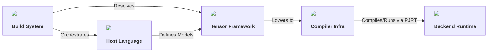

### What is StableHLO?

[StableHLO](https://github.com/openxla/stablehlo) (Stable High-Level Operations) is an opset (a set of named operations) defined by the [OpenXLA](https://openxla.org/) XLA (Accelerated Linear Algebra) project. It provides a stable, versioned intermediate representation for ML programs. ZML emits StableHLO from its tensor operations, meaning:

- `lhs.dot(rhs, .c)` → `stablehlo.dot_general`
- `x.mul(a).add(y)` → `stablehlo.multiply` + `stablehlo.add`
- `grid.slice(...)` → `stablehlo.slice` + `stablehlo.concatenate`

StableHLO is defined as an [MLIR](https://mlir.llvm.org/) dialect. MLIR (Multi-Level Intermediate Representation) is a compiler framework where different abstraction levels ("dialects") can coexist in the same program and be progressively lowered to machine code.

### What is PJRT?

[PJRT](https://github.com/openxla/xla/blob/main/xla/pjrt/c/pjrt_c_api.h) (Plugin JAX Runtime, now generalized) is a hardware-agnostic C API that separates the ML compiler frontend from hardware backends. Any PJRT-compatible plugin (CPU, GPU, TPU, custom accelerators) can be loaded at runtime. ZML uses PJRT to remain hardware-portable without embedding device-specific code.

### Context and Platform Initialization

All ZML execution flows through `context.zig`. Understanding it is essential before reading the benchmarks.

```zig
// context.zig
pub const Context = struct {
    allocator: std.mem.Allocator,
    io: std.Io,
    platform: *zml.Platform,  // the PJRT-backed device handle
    rng: std.Random.DefaultPrng,

    pub fn init(allocator: std.mem.Allocator, io: std.Io) !Context {
        return .{
            .allocator = allocator,
            .io = io,
            .platform = try .auto(allocator, io, .{}),  // auto-detect best device
            .rng = std.Random.DefaultPrng.init(0),
        };
    }

    // Upload a Zig slice to the device as a zml.Buffer
    pub fn bufferFromSlice(self: Context, shape: zml.Shape, data: anytype) !zml.Buffer {
        const replicated_sharding = try zml.sharding.replicatedSharding(self.platform);
        return zml.Buffer.fromSlice(
            self.io, self.platform,
            zml.Slice.init(shape, std.mem.sliceAsBytes(data)),
            replicated_sharding,
        );
    }

    // Download a device zml.Buffer back to a Zig slice
    pub fn sliceFromBuffer(self: Context, buffer: zml.Buffer, out: anytype) !void {
        try buffer.toSlice(self.io, zml.Slice.init(buffer.shape(), std.mem.sliceAsBytes(out)));
    }
};
```

`zml.Platform.auto()` probes the available PJRT plugins and selects the best available device (TPU > GPU > CPU). The `io: std.Io` is a Zig 0.16 abstraction over async I/O and clock access.

---

## Benchmark 1: SAXPY


**Formula:** `Z[i] = a * X[i] + Y[i]`

$$Z_i = a \cdot X_i + Y_i$$

### Algorithm Graph
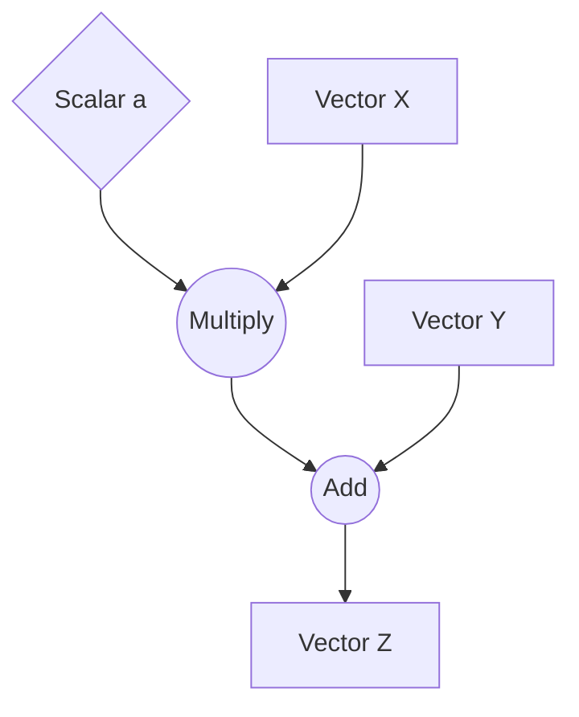

SAXPY is the "hello world" of linear algebra and BLAS. It is trivially parallelizable because each output element is independent.

### Data Flow

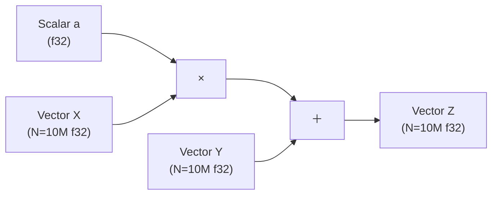

### Reference Implementation (`reference.zig`)

```zig
pub fn saxpy(n: usize, a: f32, x: []const f32, y: []const f32, out: []f32) void {
    for (0..n) |i| {
        out[i] = a * x[i] + y[i];  // one element at a time
    }
}
```

Pure single-threaded scalar loop. This is the correctness baseline. Every other implementation must match this result within an epsilon of `1e-4`.

### Optimized Implementation (`optimized.zig`)

Two layers of optimization are applied:
1. **SIMD vectorization** — process 64 floats per CPU instruction
2. **Multithreading** — divide the array into `num_threads` chunks

```zig
// The SIMD kernel
fn saxpyKernel(a: f32, x: []const f32, y: []const f32, out: []f32) void {
    const VL: usize = 64;
    const Vec: type = @Vector(VL, f32);  // SIMD vector of 64 f32 values
    var i: usize = 0;
    while (i + VL <= len) : (i += VL) {
        const x_vec: Vec = x[i..][0..VL].*;  // load 64 floats at once
        const y_vec: Vec = y[i..][0..VL].*;
        const a_vec: Vec = @splat(a);         // broadcast scalar to vector
        out[i..][0..VL].* = x_vec * a_vec + y_vec;  // fused multiply-add on 64 elems
    }
    // scalar tail for remaining elements
    while (i < len) : (i += 1) out[i] = a * x[i] + y[i];
}

// The multithreaded dispatcher
pub fn saxpy(n: usize, a: f32, x: []const f32, y: []const f32, out: []f32) void {
    const num_threads = @min(std.Thread.getCpuCount() catch 1, 16);
    const chunk_size = (n + num_threads - 1) / num_threads;
    var threads: [16]std.Thread = undefined;
    var spawned: usize = 0;
    for (0..num_threads) |t| {
        const start = t * chunk_size;
        const end = @min(start + chunk_size, n);
        threads[spawned] = std.Thread.spawn(.{}, saxpyKernel, .{
            a, x[start..end], y[start..end], out[start..end]
        }) catch { saxpyKernel(a, x[start..end], y[start..end], out[start..end]); continue; };
        spawned += 1;
    }
    for (threads[0..spawned]) |t| t.join();
}
```

### ZML Implementation (`model.zig`)

```zig
pub fn saxpy(_: SimpleModel, a: zml.Tensor, x: zml.Tensor, y: zml.Tensor) zml.Tensor {
    return x.mul(a).add(y);
}
```

Three lines. The `a` tensor is a scalar (`Shape.scalar(.f32)`), `x` and `y` are 1D tensors of shape `{N}`. ZML applies broadcasting automatically: the scalar `a` is broadcast across all N elements before multiplication.

### How the Benchmark Wires Them Together

```zig
// benchmarks.zig — SAXPY benchmark
pub fn saxpy(ctx: *Context) !void {
    const N: usize = 10_000_000;

    // 1. Allocate and randomly initialize input data
    const x_data = try ctx.allocAndInit(f32, N, ...);
    const y_data = try ctx.allocAndInit(f32, N, ...);

    // 2. Reference timing
    ref.saxpy(N, a_val, x_data, y_data, ref_out);

    // 3. Optimized timing
    opt.saxpy(N, a_val, x_data, y_data, opt_out);
    try expectApproxEq(ref_out, opt_out, 1e-4);  // verify!

    // 4. ZML: compile once, run on device
    var exe = try ctx.platform.compile(
        ctx.allocator, ctx.io, SimpleModel{}, .saxpy,
        .{ zml.Tensor.init(.{}, .f32),     // scalar a
           zml.Tensor.fromShape(shape),     // x shape descriptor
           zml.Tensor.fromShape(shape) },   // y shape descriptor
        .{ .shardings = &.{replicated_sharding} },
    );

    // Upload inputs to device
    var a_buf = try ctx.bufferFromSlice(zml.Shape.scalar(.f32), std.mem.asBytes(&a_val));
    var x_buf = try ctx.bufferFromSlice(shape, x_data);
    var y_buf = try ctx.bufferFromSlice(shape, y_data);

    args.set(.{ a_buf, x_buf, y_buf });
    exe.call(args, &results);   // execute on device

    // Download result and verify
    try ctx.sliceFromBuffer(res_buf, zml_out);
    try expectApproxEq(ref_out, zml_out, 1e-4);
}
```

The `platform.compile(...)` call is where tracing happens. The `SimpleModel{}.saxpy` function is called with abstract `zml.Tensor` descriptors (shapes, no data). The resulting computation graph is compiled via MLIR → StableHLO → PJRT. `exe.call(args, &results)` executes the compiled program on the device.

---

## Benchmark 2: MatMul


**Formula:** `C[i,j] = Σ_k A[i,k] * B[k,j]`

$$C_{i,j} = \sum_{k} A_{i,k} B_{k,j}$$

### Algorithm Graph
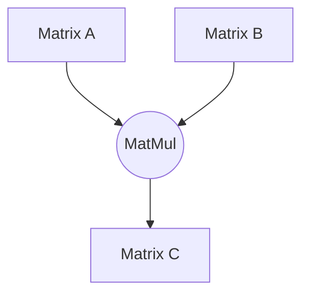

Matrix multiplication is the foundational kernel in deep learning. A 1024×1024 matrix multiply requires ~2 billion floating point operations.

### Data Flow

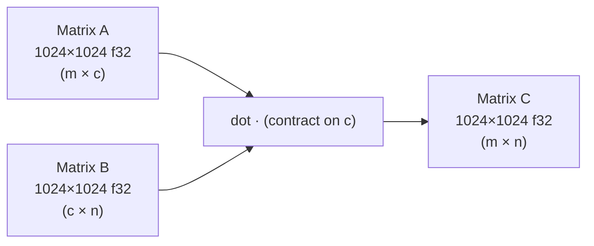

### Reference Implementation

```zig
pub fn matmul(M: usize, K: usize, N: usize, lhs: []const f32, rhs: []const f32, out: []f32) void {
    for (0..M) |m| {
        for (0..N) |n| {
            var sum: f32 = 0.0;
            for (0..K) |k| {
                sum += lhs[m * K + k] * rhs[k * N + n];
            }
            out[m * N + n] = sum;
        }
    }
}
```

Three nested loops. O(M·K·N) operations. Cache-unfriendly due to column-strided access on `rhs`.

### Optimized Implementation — Tiled + Multithreaded

```zig
fn matmulKernel(m_start: usize, m_end: usize, K: usize, N: usize,
                lhs: []const f32, rhs: []const f32, out: []f32) void {
    const NC: usize = 64;  // column tile
    const KC: usize = 64;  // reduction tile

    // Loop tiling for cache locality: process 64×64 blocks at a time
    var n: usize = 0;
    while (n < N) : (n += NC) {
        var k: usize = 0;
        while (k < K) : (k += KC) {
            for (m_start..m_end) |i| {
                for (n..@min(N, n + NC)) |j| {
                    var sum: f32 = out[i * N + j];
                    for (k..@min(K, k + KC)) |p| {
                        sum += lhs[i * K + p] * rhs[p * N + j];
                    }
                    out[i * N + j] = sum;
                }
            }
        }
    }
}
```

**Loop tiling** (64×64 blocks) ensures that the working set fits in L1/L2 cache. The outer multithreaded dispatcher assigns contiguous row-blocks to each thread, avoiding false sharing.

### ZML Implementation

```zig
pub fn matmul(_: SimpleModel, lhs: zml.Tensor, rhs: zml.Tensor) zml.Tensor {
    return lhs.dot(rhs, .c);  // contract along the .c (K) dimension
}
```

`zml.Tensor.dot(rhs, .c)` is ZML's contraction operator. The `.c` label refers to the named dimension used in the shape:
```zig
// benchmarks.zig
const lhs_shape = zml.Shape.init(.{ .m = M, .c = K }, .f32);
const rhs_shape = zml.Shape.init(.{ .c = K, .n = N }, .f32);
```
The `.c` dimension appears in both shapes. ZML contracts over it, producing a result of shape `{.m = M, .n = N}`. This is lowered to `stablehlo.dot_general` in MLIR, which OpenXLA then maps to highly optimized GEMM kernels (cuBLAS on NVIDIA, TPU matrix units on TPU).

---

## Benchmark 3: ModMatMul


**Formula:** `C[i,j] = (Σ_k A[i,k] * B[k,j]) mod Q`, where `Q = 3329`

$$C_{i,j} = \left( \sum_{k} A_{i,k} B_{k,j} \right) \pmod{Q}$$

### Algorithm Graph
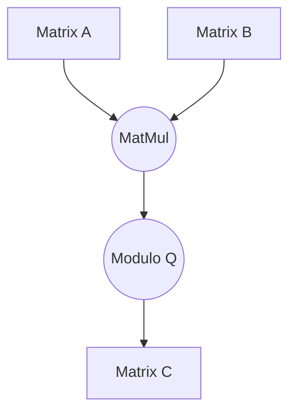

This is the kind of operation found in **post-quantum cryptography** (lattice-based schemes like Kyber/ML-KEM). The modulo operation prevents integer overflow and keeps values in a specific finite field.

### Data Flow

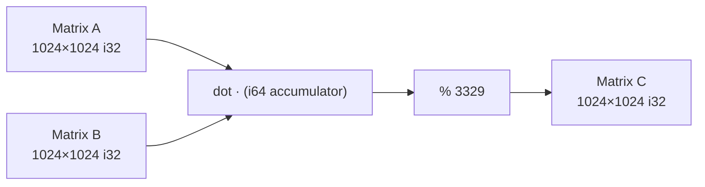

### The Type Promotion Challenge

Integer matrix multiplication with modulo requires careful type management. Each element of A and B is `i32`, but accumulating `i32 * i32` products can overflow `i32`. The solution is computing in `i64` and converting back to `i32` after the modulo.

### Reference Implementation

```zig
pub fn mod_matmul(M: usize, K: usize, N: usize, lhs: []const i32, rhs: []const i32, out: []i32) void {
    const Q: i64 = 3329;
    for (0..M) |m| {
        for (0..N) |n| {
            var sum: i64 = 0;  // accumulate in 64-bit to avoid overflow
            for (0..K) |k| {
                const a: i64 = lhs[m * K + k];
                const b: i64 = rhs[k * N + n];
                sum += a * b;
            }
            out[m * N + n] = @intCast(@mod(sum, Q));  // reduce back to i32
        }
    }
}
```

### Optimized Implementation — SIMD over `i32`/`i64` Vectors

```zig
fn modMatmulKernel(...) void {
    const Q: i64 = 3329;
    const VL: usize = 16;                     // 16 i64 values per SIMD register
    const Vec64: type = @Vector(VL, i64);

    while (j + VL <= n_end) : (j += VL) {
        var sum_vec: Vec64 = @splat(0);       // 16 accumulators
        for (0..K) |k| {
            const a_val: i64 = lhs[i * K + k];
            const a_vec: Vec64 = @splat(a_val);  // broadcast one row element
            // load 16 column elements of rhs, widened to i64
            ...
            sum_vec += a_vec * b_vec64;
        }
        // apply modulo lane-by-lane (SIMD mod not directly available)
        for (sum_arr, 0..) |s, idx| out_arr[idx] = @intCast(@mod(s, Q));
    }
}
```

### ZML Implementation

```zig
pub fn mod_matmul(_: SimpleModel, lhs: zml.Tensor, rhs: zml.Tensor) zml.Tensor {
    const Q = 3329;
    const lhs_64 = lhs.convert(.i64);            // widen to i64 before multiply
    const rhs_64 = rhs.convert(.i64);
    const res_64 = lhs_64.dot(rhs_64, .c);       // accumulate in i64
    const res_mod = res_64.remainder(zml.Tensor.scalar(Q, .i64));  // modulo
    return res_mod.convert(.i32);                 // narrow back to i32
}
```

ZML handles the type conversions declaratively. The intermediate `i64` compute graph is expressed cleanly. In MLIR terms, this becomes:
- `stablehlo.convert` (i32 → i64)
- `stablehlo.dot_general` (i64 × i64)
- `stablehlo.remainder` (modulo by scalar)
- `stablehlo.convert` (i64 → i32)

---

## Benchmark 4: Heat Transfer (2D Stencil)

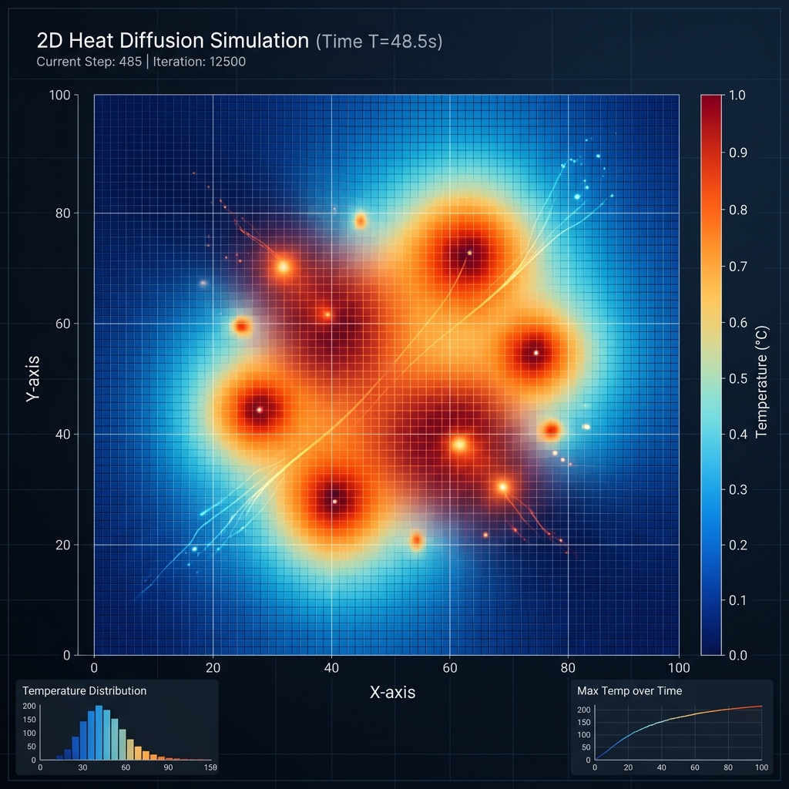

**Formula:** `U[i,j]^(t+1) = 0.25 * (U[i-1,j] + U[i+1,j] + U[i,j-1] + U[i,j+1])`

$$U_{i,j}^{(t+1)} = \frac{1}{4} \left( U_{i-1,j}^{(t)} + U_{i+1,j}^{(t)} + U_{i,j-1}^{(t)} + U_{i,j+1}^{(t)} \right)$$

### Algorithm Graph
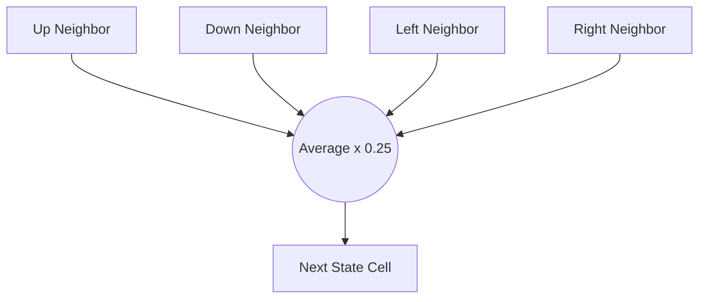

A 2D heat diffusion simulation. The grid is evolved over 100 time steps. At each step, every interior cell becomes the average of its four neighbors, modelling diffusion via the discrete Laplacian.

### Stencil Pattern

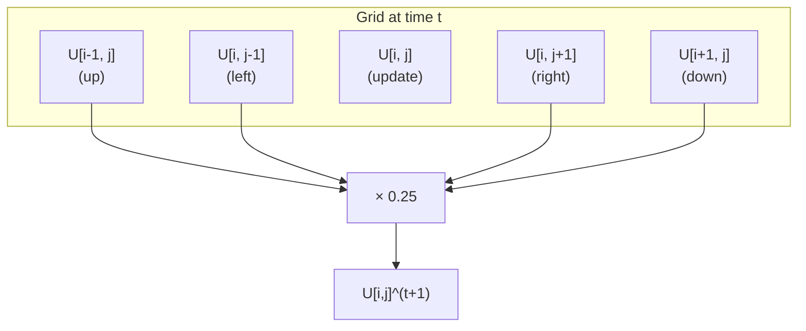

### Reference Implementation

```zig
pub fn heat_transfer(H: usize, W: usize, grid: []const f32, out: []f32) void {
    @memcpy(out, grid);  // preserve boundaries by copying first
    for (1..H - 1) |i| {
        for (1..W - 1) |j| {       // skip border cells
            const up    = grid[(i - 1) * W + j];
            const down  = grid[(i + 1) * W + j];
            const left  = grid[i * W + j - 1];
            const right = grid[i * W + j + 1];
            out[i * W + j] = 0.25 * (up + down + left + right);
        }
    }
}
```

Boundaries are kept fixed (Dirichlet boundary conditions). The initial state has the top row set to `100.0`, all others to `0.0`, simulating a heat source.

### Optimized Implementation — SIMD Horizontal Stencil

```zig
fn heatTransferKernel(row_start: usize, row_end: usize, W: usize, ...) void {
    const VL: usize = 64;
    const Vec: type = @Vector(VL, f32);
    const quarter: Vec = @splat(0.25);

    for (row_start..row_end) |i| {
        var j: usize = 1;
        while (j + VL <= W - 1) : (j += VL) {
            // Load 4 neighbor tiles simultaneously
            const up:    Vec = grid[(i - 1) * W + j ..][0..VL].*;
            const down:  Vec = grid[(i + 1) * W + j ..][0..VL].*;
            const left:  Vec = grid[i * W + j - 1 ..][0..VL].*;  // offset by -1
            const right: Vec = grid[i * W + j + 1 ..][0..VL].*;  // offset by +1
            out[i * W + j ..][0..VL].* = (up + down + left + right) * quarter;
        }
        // scalar tail...
    }
}
```

The SIMD kernel loads 64-wide slices for each of the four neighbors simultaneously. Notice that `left` reads from `j-1` and `right` reads from `j+1`—these are aligned memory reads that work correctly because the stencil accesses adjacent elements, not strided ones.

### ZML Implementation — Slicing + StableHLO While Loop

The step logic is extracted into a private helper and the public entry point uses `zml.ops.@"while"` to fold all iterations into a single compiled loop:

```zig
// Private: one simulation step (slicing approach)
fn heat_transfer_step(grid: zml.Tensor) zml.Tensor {
    // Extract shifted views using slice operations
    const up    = grid.slice(&.{ .{ .end = -2 }, .{ .start = 1, .end = -1 } });
    const down  = grid.slice(&.{ .{ .start = 2 }, .{ .start = 1, .end = -1 } });
    const left  = grid.slice(&.{ .{ .start = 1, .end = -1 }, .{ .end = -2 } });
    const right = grid.slice(&.{ .{ .start = 1, .end = -1 }, .{ .start = 2 } });

    // Compute average of neighbors
    const center = up.add(down).add(left).add(right).mul(zml.Tensor.scalar(0.25, .f32));

    // Reconstruct full grid with original borders preserved
    const top_row    = grid.slice(&.{ .{ .end = 1 }, .{} });
    const bottom_row = grid.slice(&.{ .{ .start = -1 }, .{} });
    const left_col   = grid.slice(&.{ .{ .start = 1, .end = -1 }, .{ .end = 1 } });
    const right_col  = grid.slice(&.{ .{ .start = 1, .end = -1 }, .{ .start = -1 } });

    const middle_row = zml.Tensor.concatenate(&.{ left_col, center, right_col }, 1);
    return zml.Tensor.concatenate(&.{ top_row, middle_row, bottom_row }, 0);
}

// Public single-step wrapper (kept for unit tests)
pub fn heat_transfer(_: SimpleModel, grid: zml.Tensor) zml.Tensor {
    return heat_transfer_step(grid);
}

// Public multi-step entry point: runs `steps` iterations via a StableHLO while loop
pub fn heat_transfer_steps(_: SimpleModel, grid: zml.Tensor, steps: zml.Tensor) zml.Tensor {
    const Local = struct {
        fn cond(step_idx: zml.Tensor, _: zml.Tensor, total_steps: zml.Tensor) zml.Tensor {
            return step_idx.cmp(.LT, total_steps);
        }
        fn body(step_idx: zml.Tensor, curr_grid: zml.Tensor, _: zml.Tensor) [2]zml.Tensor {
            return .{
                step_idx.add(zml.Tensor.scalar(1, .i32)),
                SimpleModel.heat_transfer_step(curr_grid),
            };
        }
    };

    const loop_state = zml.ops.@"while"(
        .{ zml.Tensor.scalar(0, .i32), grid },
        Local.cond,
        Local.body,
        .{steps},
    );
    return loop_state[1];
}
```

Rather than using loop indices to shift the stencil, ZML uses **tensor slicing**. `grid.slice(&.{ .{ .end = -2 }, ... })` is equivalent to `grid[0:-2, :]`—it produces a tensor that is 2 rows shorter, representing the "up" neighbor for every interior cell. The border rows/columns are reconstructed via `concatenate`, preserving the Dirichlet boundary condition.

`heat_transfer_steps` passes `steps` as a `zml.Tensor` (an `i32` scalar) and drives all iterations inside a **single `stablehlo.while` op**. The loop state carries a step counter and the current grid; the condition checks `step_idx < total_steps` and the body increments the counter and applies one stencil step. This means the compiler sees the entire iterative computation as one graph and can fuse and optimise across iteration boundaries.

### Benchmark — Single Call with StableHLO While

```zig
// Upload grid and step count to device
var zml_in_buf = try ctx.bufferFromSlice(shape, grid_init);
var steps_i32: i32 = @intCast(steps);
var steps_buf = try ctx.bufferFromSlice(zml.Shape.scalar(.i32), std.mem.asBytes(&steps_i32));

// Compile heat_transfer_steps: takes (grid, steps_tensor)
var exe = try ctx.platform.compile(
    ctx.allocator, ctx.io, SimpleModel{}, .heat_transfer_steps,
    .{ zml.Tensor.fromShape(shape), zml.Tensor.init(.{}, .i32) },
    .{ .shardings = &.{replicated_sharding} },
);

// Single call — all iterations run inside the compiled StableHLO while loop
args.set(.{ zml_in_buf, steps_buf });
exe.call(args, &results);
var final_buf: zml.Buffer = results.get(zml.Buffer);
defer final_buf.deinit();
```

The `steps` count is now compiled into the graph as a runtime `i32` tensor. All iterations execute within a single `stablehlo.while` op on the device—no host-side loop, no repeated buffer swaps. This gives the XLA compiler visibility over the full iterative sequence and eliminates round-trip dispatch overhead for each step.

---

## Benchmark 5: Black-Scholes Option Pricing

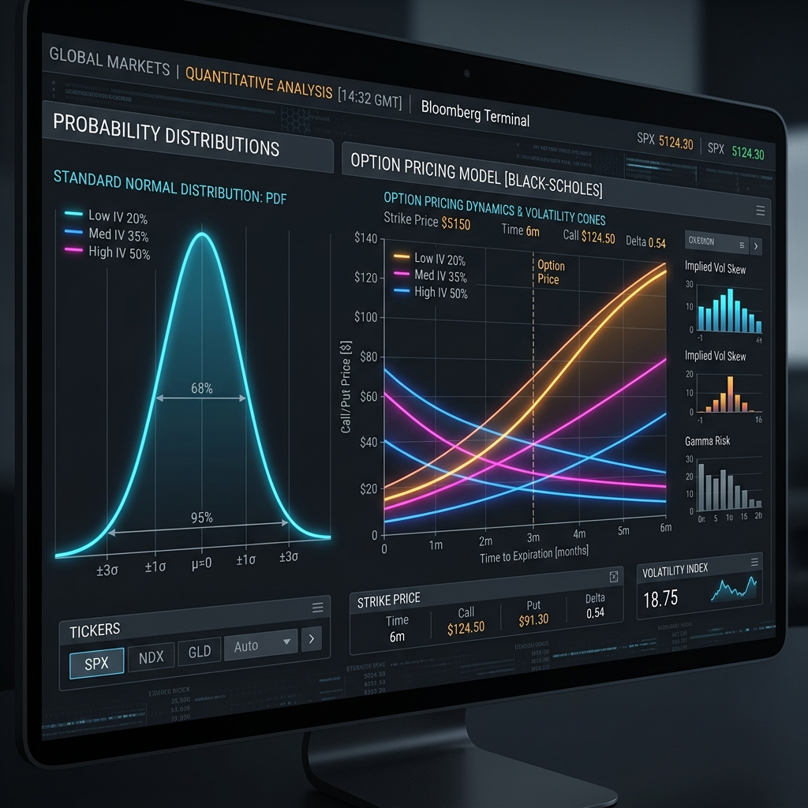


**Formula:**

```
C = S₀·Φ(d₁) - K·e^(-rT)·Φ(d₂)
d₁ = [ln(S₀/K) + (r + σ²/2)·T] / (σ·√T)
d₂ = d₁ - σ·√T
Φ = standard normal CDF (approximated by polynomial)
```

$$C = S_0 \Phi(d_1) - K e^{-rT} \Phi(d_2)$$
$$d_1 = \frac{\ln(S_0/K) + (r + \sigma^2/2)T}{\sigma \sqrt{T}}$$
$$d_2 = d_1 - \sigma \sqrt{T}$$

### Algorithm Graph
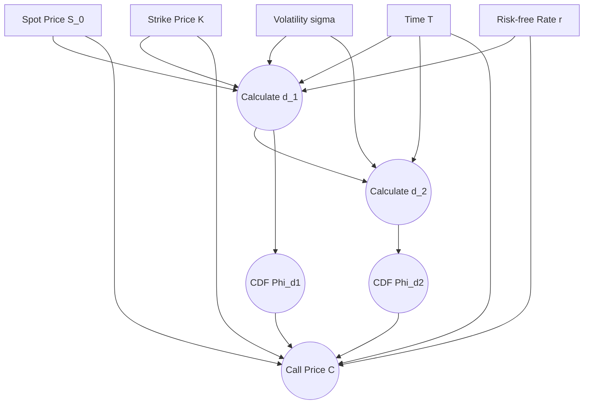

Black-Scholes prices European call and put options. `Φ` (the standard normal CDF) is approximated using Horner's method with a polynomial fitting.

### Data Flow

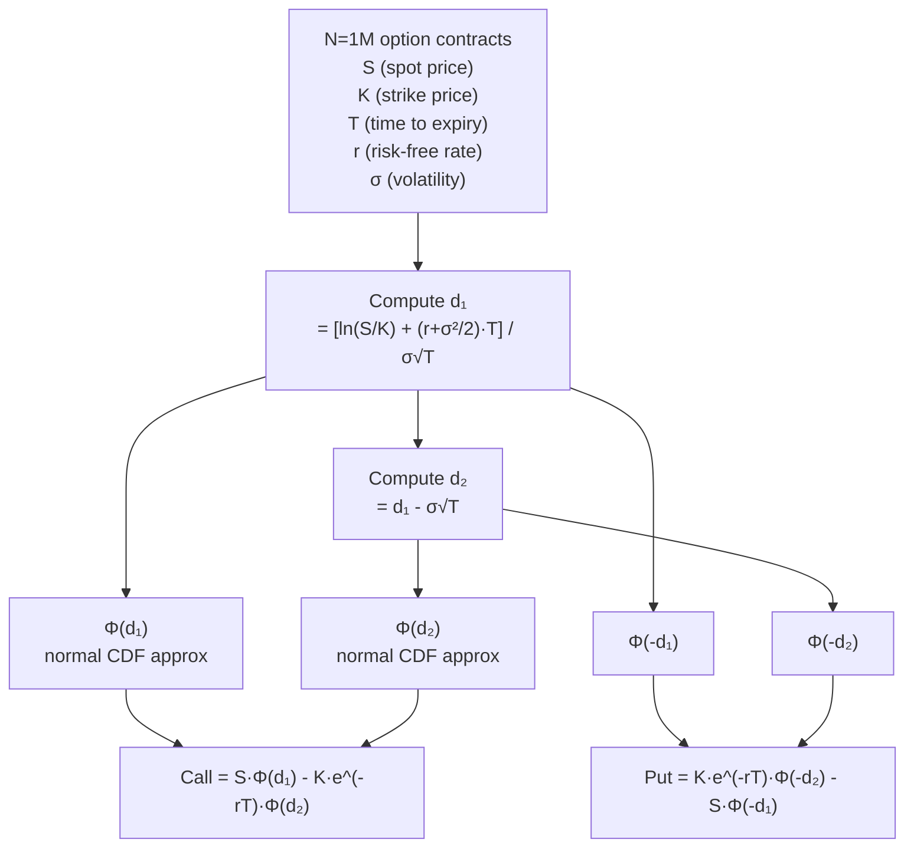

### Reference Implementation

```zig
fn std_normal_cdf(x: f32) f32 {
    const p: f32 = 0.3275911;
    const a1: f32 = 0.254829592;
    // ... (Abramowitz & Stegun polynomial approximation)
    const v = x / @sqrt(2.0);
    const z = @abs(v);
    const t = 1.0 / (1.0 + p * z);
    const poly = t * (a1 + t * (a2 + t * (a3 + t * (a4 + t * a5))));  // Horner's
    const y = 1.0 - poly * @exp(-z * z);
    const sign: f32 = if (v >= 0) 1.0 else -1.0;
    return 0.5 * (1.0 + sign * y);
}

pub fn black_scholes(n: usize, s: []const f32, k: []const f32, ...) void {
    for (0..n) |i| {
        const sqrt_t = @sqrt(t[i]);
        const d1 = (@log(s[i] / k[i]) + (r[i] + 0.5 * sigma[i] * sigma[i]) * t[i]) / (sigma[i] * sqrt_t);
        const d2 = d1 - sigma[i] * sqrt_t;
        const k_exp_rt = k[i] * @exp(-r[i] * t[i]);
        call[i] = s[i] * std_normal_cdf(d1) - k_exp_rt * std_normal_cdf(d2);
        put[i]  = k_exp_rt * std_normal_cdf(-d2) - s[i] * std_normal_cdf(-d1);
    }
}
```

### Optimized Implementation — Vectorized CDF

```zig
fn stdNormalCdf(comptime VL: usize, x: @Vector(VL, f32)) @Vector(VL, f32) {
    const Vec: type = @Vector(VL, f32);
    // All constants broadcast to vectors
    const p:   Vec = @splat(0.3275911);
    const one: Vec = @splat(1.0);
    ...
    const v = x * sqrt2_inv;
    const z = @abs(v);
    const t = one / (one + p * z);
    const poly = t * (a1 + t * (a2 + t * (a3 + t * (a4 + t * a5))));  // Horner's vectorized
    const y = one - poly * @exp(-z * z);  // @exp operates on the entire vector
    const sign = @select(f32, v >= zero, one, @as(Vec, @splat(-1.0)));
    return half * (one + sign * y);
}
```

The key insight: Zig's `@Vector(VL, f32)` maps to SIMD registers. Operations like `@exp(-z * z)` are automatically vectorized—computing 64 exponentials in parallel using platform SIMD intrinsics.

### ZML Implementation

```zig
fn std_normal_cdf(x: zml.Tensor) zml.Tensor {
    // All constants are scalar tensors broadcast by ZML automatically
    const v = x.scale(1.0 / @sqrt(2.0));
    const z = v.abs();
    const t = zml.Tensor.scalar(1.0, .f32).div(z.scale(p).add(zml.Tensor.scalar(1.0, .f32)));
    // Horner's method as tensor ops:
    const poly = t.scale(a5).add(scalar(a4)).mul(t).add(scalar(a3)).mul(t)
                  .add(scalar(a2)).mul(t).add(scalar(a1)).mul(t);
    const y = scalar(1.0).sub(poly.mul(z.mul(z).scale(-1.0).exp()));
    const sign = v.cmp(.GE, scalar(0.0)).select(scalar(1.0), scalar(-1.0));
    return scalar(0.5).mul(scalar(1.0).add(sign.mul(y)));
}

pub fn black_scholes(_: SimpleModel, s: zml.Tensor, k: zml.Tensor,
                     t: zml.Tensor, r: zml.Tensor, sigma: zml.Tensor) BlackScholesResult {
    const sqrt_t = t.sqrt();
    const sigma_sqrt_t = sigma.mul(sqrt_t);
    const d1 = s.div(k).log().add(r.add(sigma.mul(sigma).scale(0.5)).mul(t)).div(sigma_sqrt_t);
    const d2 = d1.sub(sigma_sqrt_t);
    const k_exp_rt = k.mul(r.mul(t).scale(-1.0).exp());
    const call = s.mul(std_normal_cdf(d1)).sub(k_exp_rt.mul(std_normal_cdf(d2)));
    const put  = k_exp_rt.mul(std_normal_cdf(d2.scale(-1.0))).sub(s.mul(std_normal_cdf(d1.scale(-1.0))));
    return .{ .call = call, .put = put };
}
```

Black-Scholes returns a **struct** with two tensors. This is a key ZML V2 feature: model functions can return multiple outputs as structs. The benchmark receives them back via:
```zig
const ResStruct = struct { call: zml.Buffer, put: zml.Buffer };
var res_bufs = results.get(ResStruct);
```

---

## Summary: Three Paradigms Side by Side

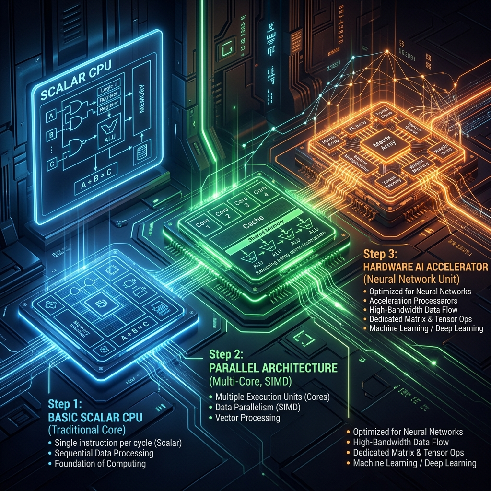

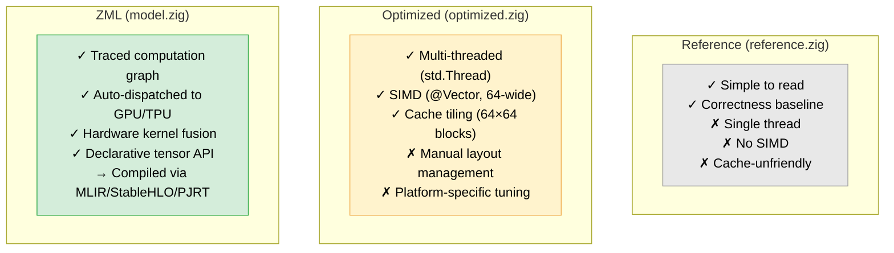

| Benchmark | Problem Size | Notes |
|---|---|---|
| SAXPY | N = 10,000,000 f32 | Memory-bandwidth bound |
| MatMul | 1024×1024 f32 | Compute-bound, GEMM |
| ModMatMul | 1024×1024 i32 | Lattice crypto workload |
| Heat Transfer | 256×256, 100 steps | Stencil, iterative |
| Black-Scholes | N = 1,000,000 f32 | Transcendental functions |

```zig
// main.zig: the entire benchmark suite
pub fn main(init: std.process.Init) !void {
    var ctx = try Context.init(init.gpa, init.io);
    defer ctx.deinit();

    try bench.saxpy(&ctx);
    try bench.matmul(&ctx);
    try bench.mod_matmul(&ctx);
    try bench.heat_transfer(&ctx);
    try bench.black_scholes(&ctx);
}
```

Run everything with:
```bash
bazel run -c opt //simple            # run full benchmark suite
bazel test //simple:simple_test       # test reference vs optimized
bazel run //simple:simple_test_zml    # test ZML model correctness
```

---

## Conclusion

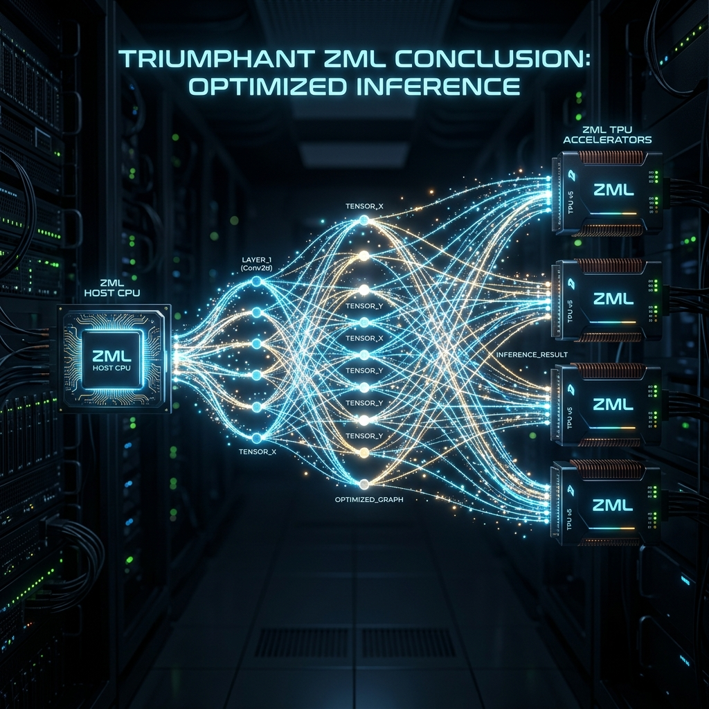

This project serves as a learning platform for three distinct abstraction levels in high-performance computing with Zig 0.16:

- **`reference.zig`** teaches the algorithm in its simplest form—readable, correct, measurable.
- **`optimized.zig`** shows how Zig's `@Vector` and `std.Thread` primitives can extract near-peak CPU performance without leaving the language.
- **`model.zig`** demonstrates ZML V2's tensor model: write math declaratively, compile once via MLIR/StableHLO/PJRT, run anywhere—CPU, GPU, or TPU.

Bazel holds the entire stack together: Zig 0.16 (pre-release), ZML (pinned to a specific commit), and LLVM, all reproducibly managed in a hermetic build graph.

The best starting point is `bazel run -c opt //simple` and observing the timing differences across the three strategies on local hardware.

---

## Prerequisites

* **Zig** toolchain (compatible with the versions specified in your Bazel workspace).
* **Bazel** build system.

## Usage

Because the project uses Bazel, you can build, run, and test the suite using standard Bazel commands.

**To run the main benchmark suite:**
```bash
bazel run -c opt //simple
```
**To run the standard unit tests (verifying `optimized.zig` vs `reference.zig`):**
```bash
bazel test //simple:simple_test
```
**To run the ZML specific tests:**
```bash
bazel run //simple:simple_test_zml
```
